# Neural-Art


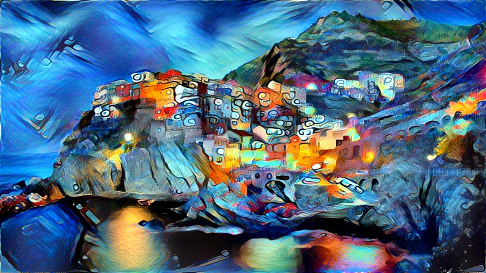</img>
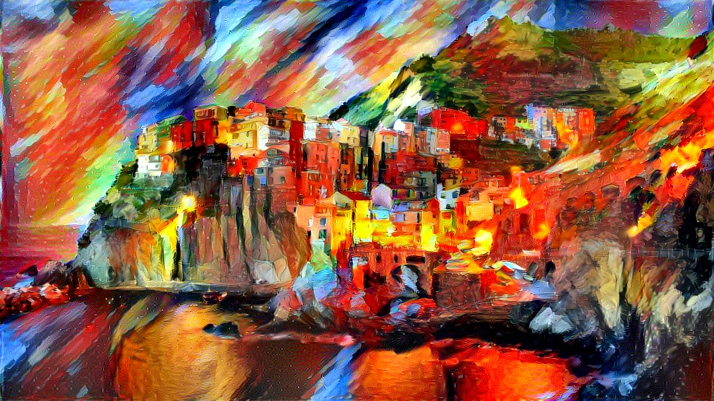</img>

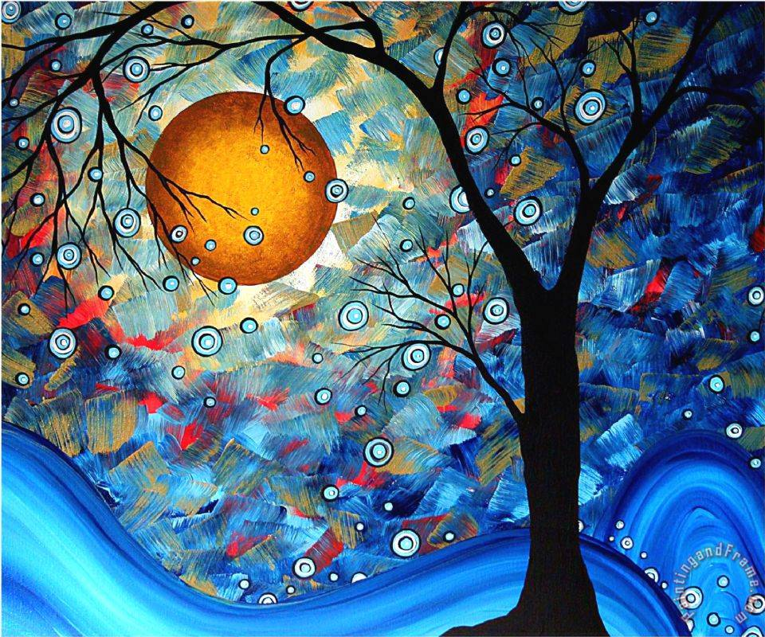</img>
</img>
</img>

##Overview

This project creates art using structures learned by the vgg19 neural network. The algorithm starts with a random uniform distribution of noise which is then updated to become the resulting image. This is done by giving the vgg19 network three seperate inputs: random uniform noise, the style image, and the content image. The activations of the vgg19 network are then compared for each of the given inputs. The loss becomes the sum of these differences. To minimize the loss, we take the deriviative of the loss with respect to the model input. Then the model input (noise) is updated to reflect its contribution to the loss. This process is iterated about 1,500 times for optimal results.


###To use:
1. Download the weights for the trained vgg19 network <a href="https://mega.nz/#!xZ8glS6J!MAnE91ND_WyfZ_8mvkuSa2YcA7q-1ehfSm-Q1fxOvvs">here</a>. Then put it in the root of the project.
2. To run using default settings : 
 * ``` python3 transfer.py ``` 
* If you wish to sepcify the content and style images:
 * ``` python3 transfer.py -style_image_path [path to image] -content_image_path [path to image] ```
* To find out all command line arguments:
 * ``` python3 transfer.py -h ```
* To duplicate my results exactly:
 * Make sure the shell script is executable ```chmod +x batchRun.sh ```
 * Run the script ```./batchRun.sh ```


###Dependencies:
	1. Python3
	2. Tensorflow
	3. Pillow
	4. Scipy
	5. Numpy
	3. (optional) GPU (<1 min with Titan X pascal, hours on 2014 macbook pro (no gpu)))


###Comparison


<p>Content:</p> 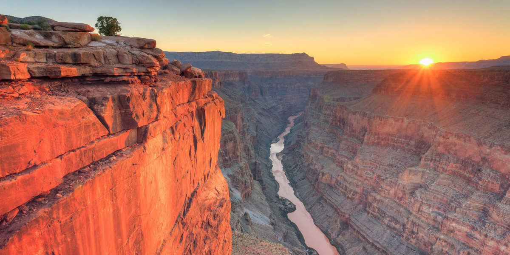</img>
<table style="width:100%">
  <tr>
    <th>Style</th> 
    <th>Result</th>
  </tr>
  <tr>
  <td>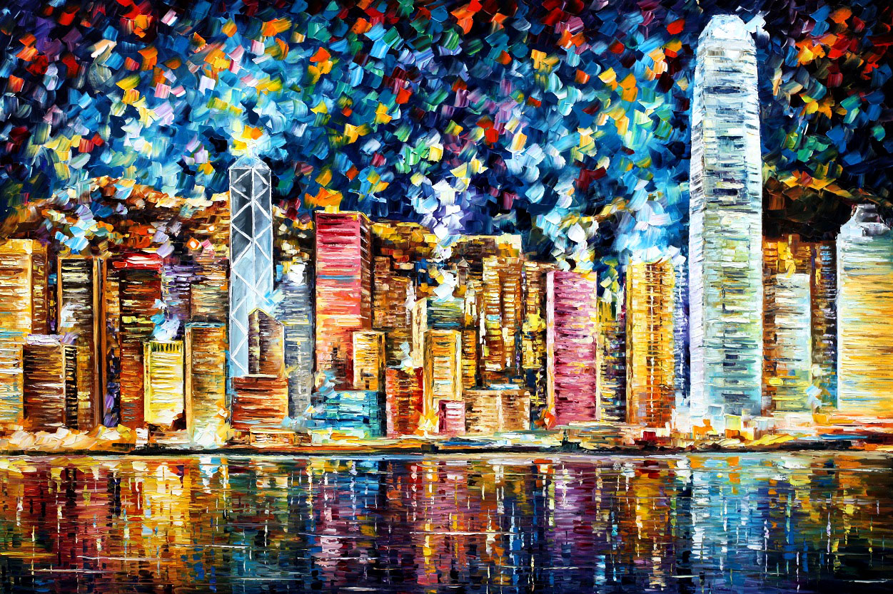</td>
    <td>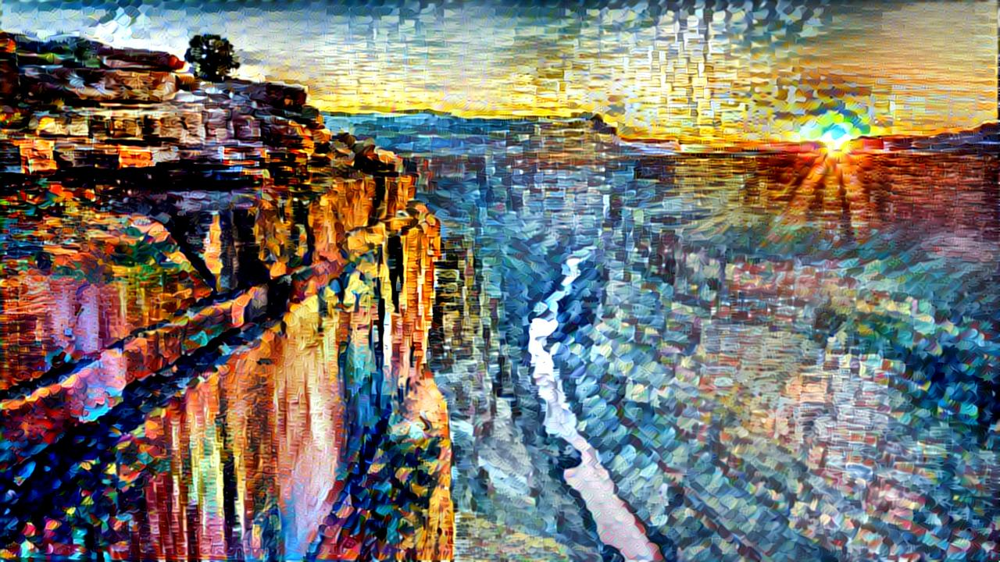</td> 
  </tr>

  <tr>
  <td>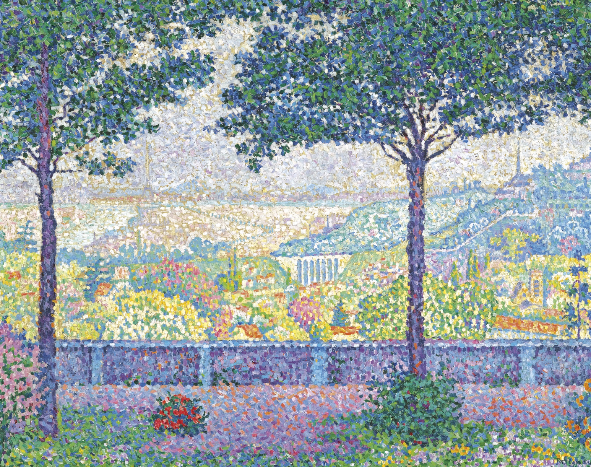</td>
    <td>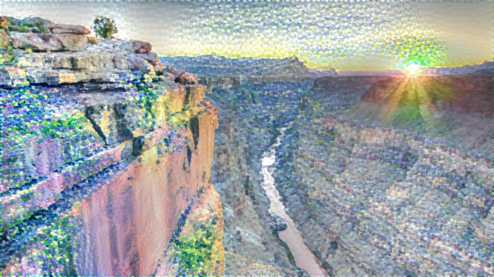</td> 
  </tr>
  
  
  <tr>
  <td></td>
    <td>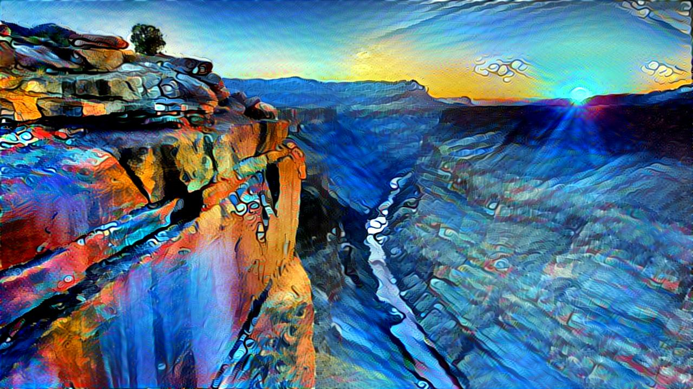</td> 
  </tr>
  
  
  <tr>
  <td></td>
    <td>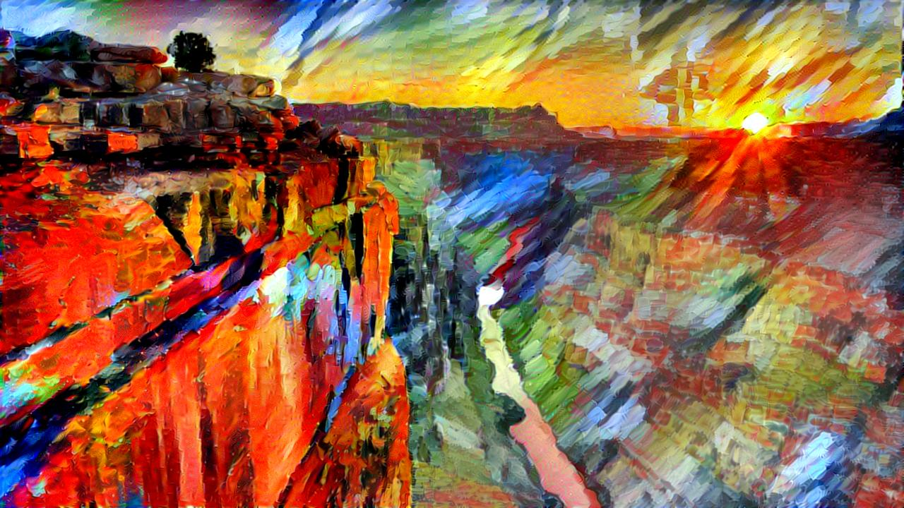</td> 
  </tr>
  
  
  <tr>
  <td>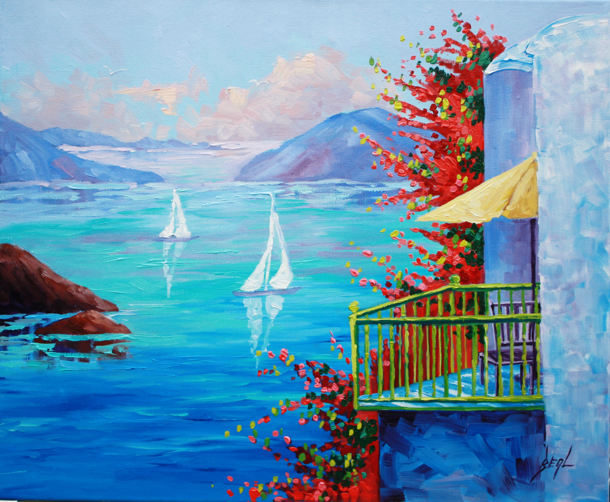</td>
    <td>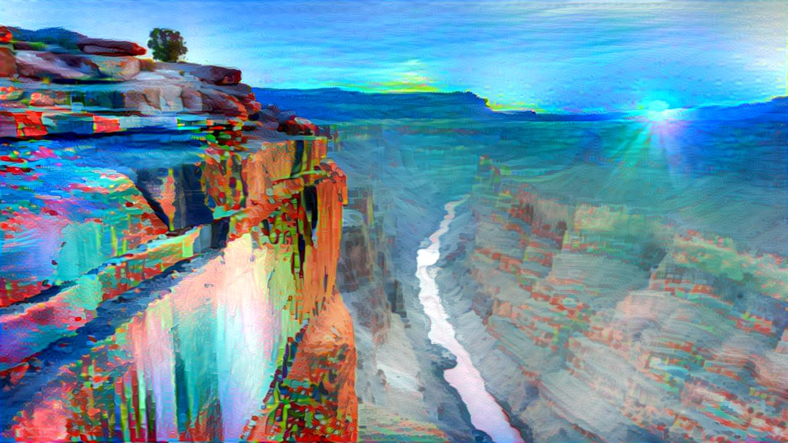</td> 
  </tr>
 </table>


<p>Content:</p> </img>
<table style="width:100%">
  <tr>
    <th>Style</th> 
    <th>Result</th>
  </tr>
  <tr>
  <td></td>
    <td>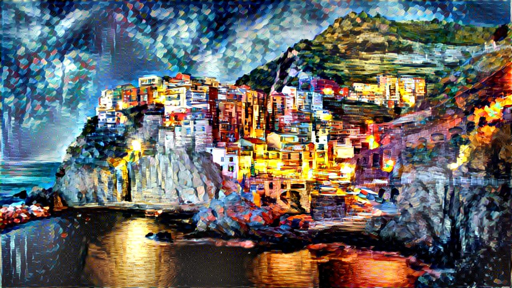</td> 
  </tr>

  <tr>
  <td></td>
    <td>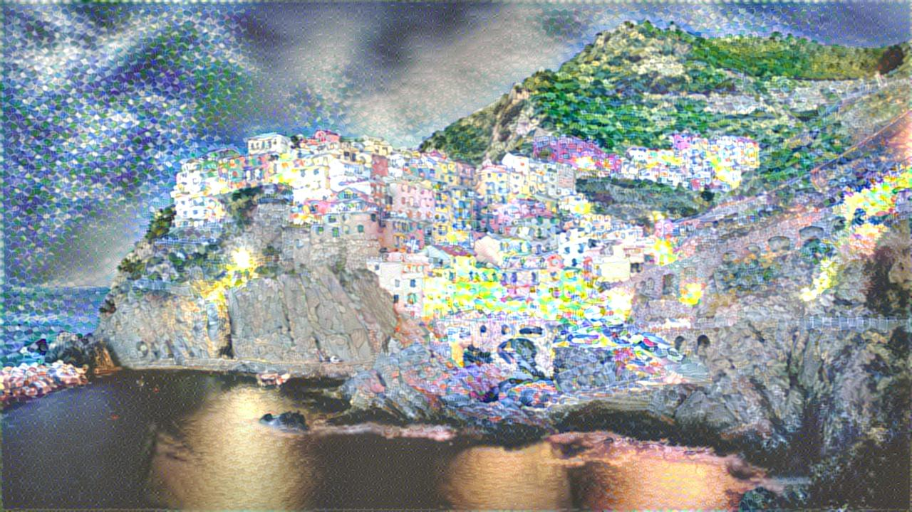</td> 
  </tr>
  
  
  <tr>
  <td></td>
    <td>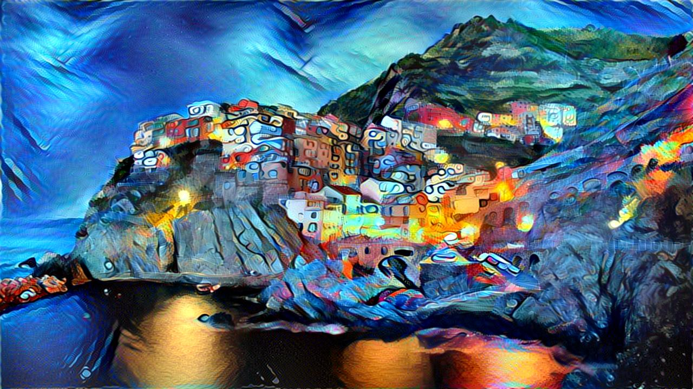</td> 
  </tr>
  
  
  <tr>
  <td></td>
    <td></td> 
  </tr>
  
  
  <tr>
  <td></td>
    <td>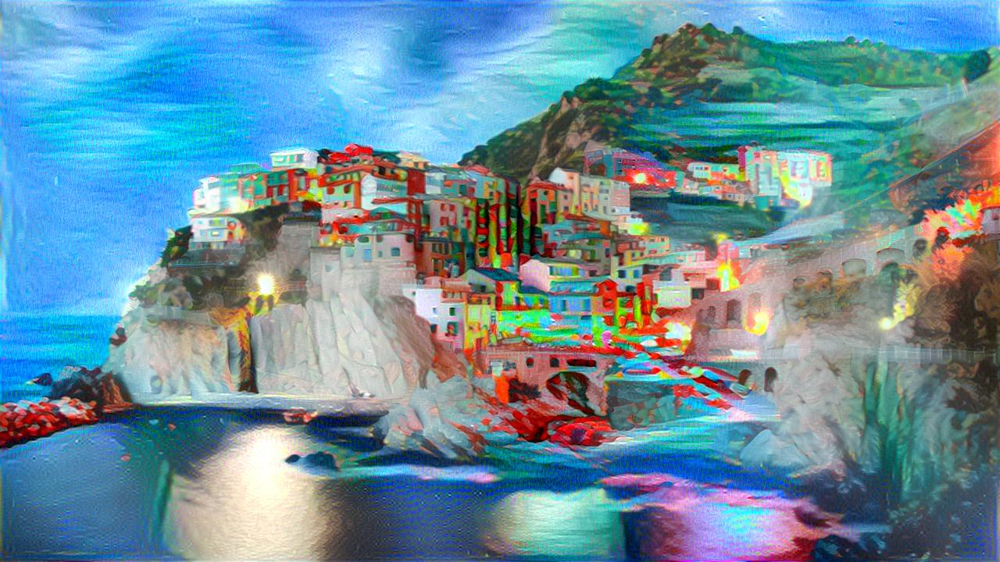</td> 
  </tr>
 </table>


###Credits

#####References
<ul><li><a href="https://arxiv.org/pdf/1505.07376v3.pdf">Texture Synthesis Using Convolutional Neural Networks (Gatys et al.)</a></li>
<li><a href="https://www.robots.ox.ac.uk/~vedaldi/assets/pubs/mahendran15understanding.pdf">Understanding Deep Image Representations by Inverting Them (Mahendran,Vedaldi)</a></li></ul>


#####VGG network

https://github.com/machrisaa/tensorflow-vgg
