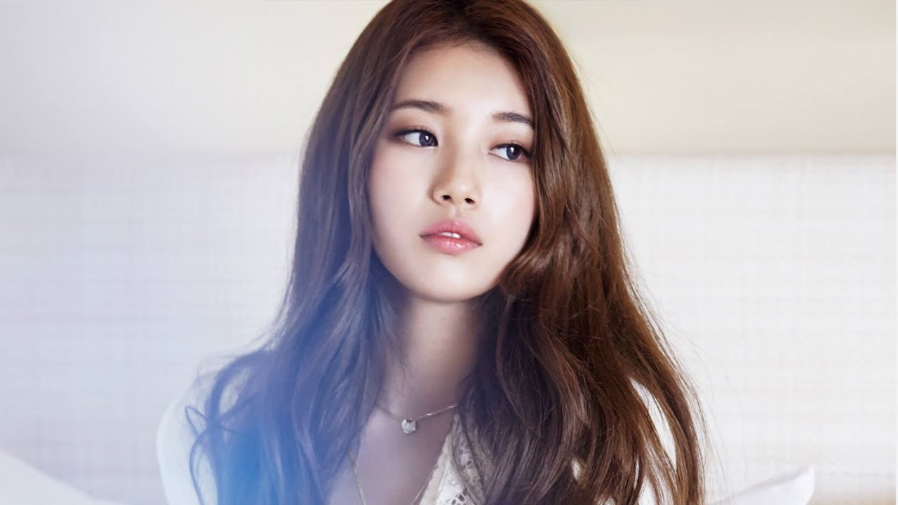
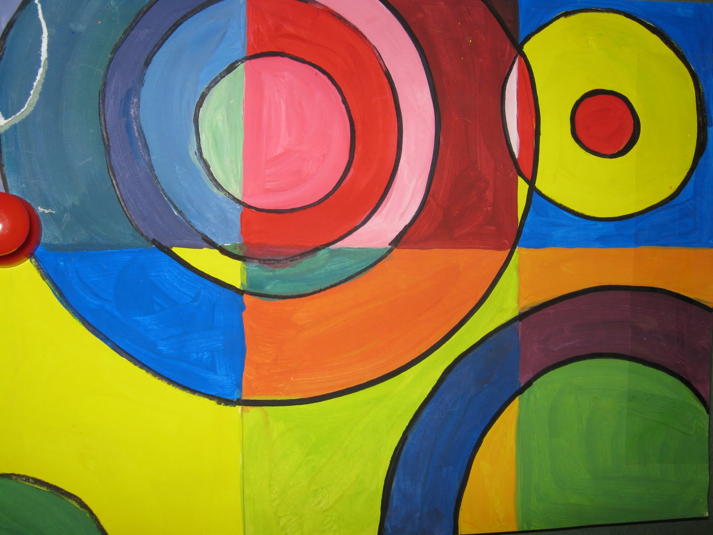
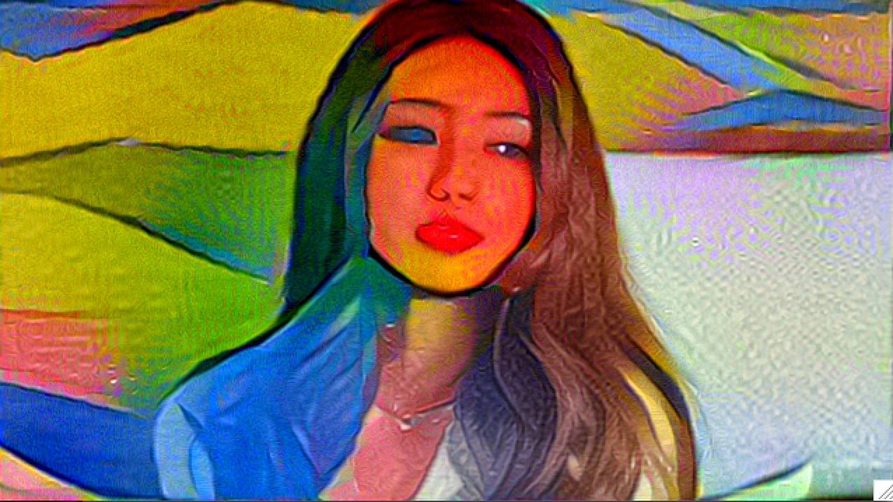
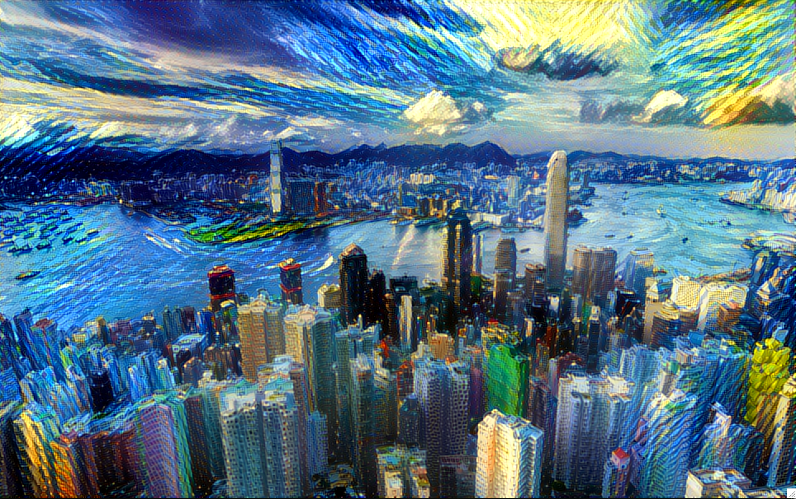

# neural_art

This project creates art using structures learned by the vgg19 neural network. The art is created by applying a style image to a content image (See example below). 

<ul><li><a href="https://arxiv.org/pdf/1505.07376v3.pdf">Texture Synthesis Using Convolutional Neural Networks (Gatys et al.)</a></li>
<li><a href="https://www.robots.ox.ac.uk/~vedaldi/assets/pubs/mahendran15understanding.pdf">Understanding Deep Image Representations by Inverting Them (Mahendran,Vedaldi)</a></li></ul>

###To use:

1. Download the weights for the trained vgg19 network <a href="https://mega.nz/#!xZ8glS6J!MAnE91ND_WyfZ_8mvkuSa2YcA7q-1ehfSm-Q1fxOvvs">here</a>

2. Run transfer.py

###Dependencies:
	1. Python3
	2. Tensorflow
	3. Pillow
	4. Scipy
	5. Numpy
	3. (optional) GPU (<1 min with Titan X pascal, hours on 2014 macbook pro (no gpu)))
	
	

	

<table style="width:100%">
  <tr>
    <th>Content</th>
    <th>Style</th> 
    <th>Result</th>
  </tr>
  <tr>
  <td></td>
    <td></td> 
      <td></td>
    
  </tr>
  
  <tr>
  <td></td>
    <td></td> 
      <td></td>
    
  </tr>
 </table>

